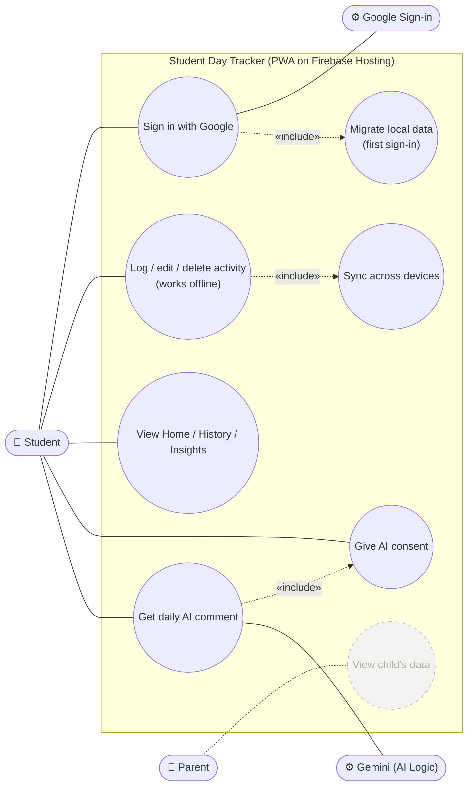
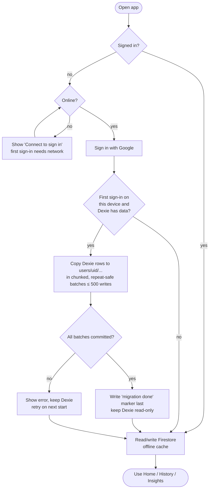
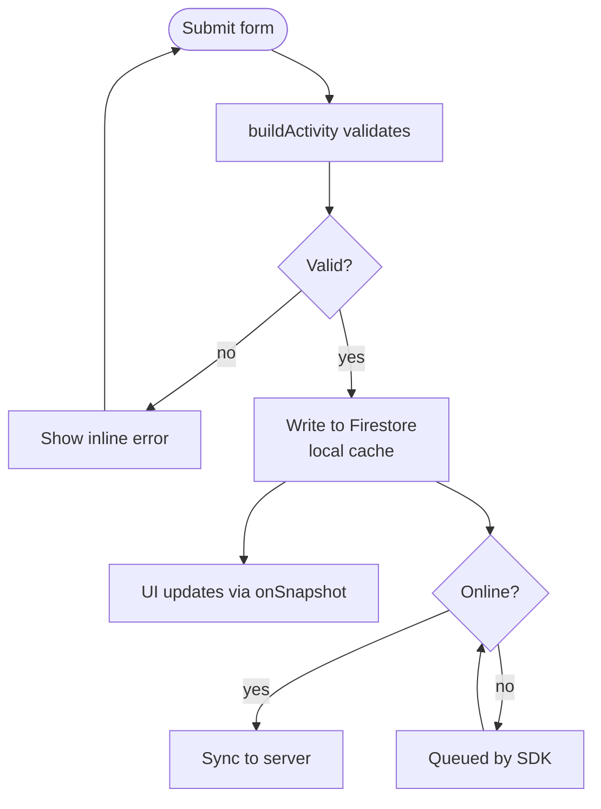

# ADR-007: Firebase for auth, sync, hosting, and AI

| | |
|---|---|
| **Status** | Accepted — 2026-10-01 |
| **Supersedes** | [ADR-001](../docs/DECISIONS.md#adr-001-dexie-indexeddb-instead-of-a-backend) (Dexie, no backend) |
| **Resolves** | Decision D-A in [`plans/2026-10-01-v2-roadmap-cross-midnight.html`](../plans/2026-10-01-v2-roadmap-cross-midnight.html) |
| **Requirement** | [`docs/REQUIREMENTS.md`](../docs/REQUIREMENTS.md) §4 (`requirement/Requirement.txt`) |

## Context

The v2 requirements add "Tạo User và đăng nhập", a parent-facing angle, and AI-generated
comments/suggestions. The owner wants to deploy on a newly bought domain, develop through GitHub,
and call Gemini. ADR-001's reasons for "no backend" (no multi-device, no auth, no sharing) no
longer hold.

Options weighed: self-hosted **PocketBase** (VPS or home machine + Cloudflare Tunnel) vs.
**Firebase**. The first release is meant to be a **small app** at (near) zero running cost.

## Decision

Use Firebase, staying on the **no-cost Spark plan** (no billing account linked).

| Concern | Firebase service | Notes |
|---|---|---|
| Sign-in | **Authentication** | Google provider |
| Data | **Cloud Firestore** (`asia-southeast1`) | Web offline persistence; replaces Dexie as source of truth. Existing Dexie data migrated once on first sign-in |
| Access control | **Security Rules** | Each user reads/writes only their own data; tested on the Emulator Suite |
| Hosting | **Firebase Hosting** | Serves the existing Next.js static export; custom domain (or `*.web.app` until bought) |
| CI/CD | **GitHub Actions** | Deploy on merge to `master`, preview channel per PR |
| AI | **Firebase AI Logic → Gemini Developer API** (free tier) | Called from the client, protected by **App Check**; no API key in the bundle, no Cloud Functions |

**Out of scope** (needs the Blaze plan or a separate decision): user-uploaded stickers (Cloud
Storage requires Blaze since 2026-02-03), Cloud Functions, phone/SMS auth, the parent view, a paid
Gemini tier. Stickers ship as a built-in pack until then.

## Use-case diagram (UD)



*Dashed use case = out of scope for this ADR (parent view).*

## Activity diagram (AD)

### App start, sign-in, and first-time migration



### Logging an activity (offline-first)



### Daily AI comment

```mermaid
flowchart TD
  a([Open Insights]) --> c{AI consent given?}
  c -- no --> ask[Show consent screen] --> c2{Accepted?}
  c2 -- no --> rule[Rule-based comment]
  c2 -- yes --> cache
  c -- yes --> cache{Comment cached<br/>for today?}
  cache -- yes --> show[Show cached comment]
  cache -- no --> on{Online and<br/>under quota?}
  on -- no --> rule
  on -- yes --> agg[Build aggregated,<br/>non-identifying summary]
  agg --> call[AI Logic → Gemini<br/>with App Check token]
  call --> res{Success?}
  res -- yes --> save[Cache comment for today] --> show
  res -- no --> rule
  rule --> done([Done])
  show --> done
```

## Why Firebase over PocketBase

- **Offline sync is built in** to Firestore; with PocketBase we would hand-write Dexie ⇄ server
  sync — the hardest part of the migration.
- **Gemini is reachable safely** without running our own proxy.
- **No server** to operate, back up, or patch; Hosting + GitHub Actions integration is
  first-party.

## Consequences

- ✅ Real accounts, multi-device sync, and AI features at ~0 đ/month (plus the domain,
  ~300–560k đ/year).
- ✅ Pure helpers (`build*`, `get-*-summary`, Insights helpers) are unchanged — they still take
  arrays and return values. Only `db.ts` and the `use-*` data hooks are rewritten.
- ✅ [ADR-002](../docs/DECISIONS.md#adr-002-nextjs-not-vite) still holds: the Firebase JS SDK runs
  client-side, so the app stays a static export (no SSR, no Server Actions).
- ⚠️ [ADR-004](../docs/DECISIONS.md#adr-004-no-global-state-library)'s "Dexie via `useLiveQuery`"
  becomes Firestore `onSnapshot` subscriptions; the no-global-store rule stays.
- ⚠️ First sign-in needs a network connection; after that the app works offline.
- ⚠️ Vendor lock-in to Google; NoSQL data model (no joins).
- ⚠️ Spark quotas (e.g. Firestore 50K reads / 20K writes per day; Gemini free tier is model-dependent,
  e.g. ~1,500 requests/day for Flash, **per project**, shared by all users). AI calls are cached (≤ 1 per user per day)
  and fall back to rule-based comments when offline or over quota.
- ⚠️ Gemini free-tier inputs may be used by Google to improve its products. Send only aggregated,
  non-identifying numbers (no names, emails, or free-text activity names), and show a consent
  screen before the first AI call — users are minors.
- ⚠️ Moving to Blaze later (sticker uploads, Functions) requires a budget alert before enabling
  billing; paid Gemini prices are announced to double from 2027-01-01.
