# ADR-008: Onboarding habit questionnaire (slice 2)

| | |
|---|---|
| **Status** | **Accepted** — owner approved 2026-10-03 (images ①–⑨, defaults D1–D10). |
| **Requirement** | `requirement/Requirement.txt`: “Ở lần đầu tiên, đưa ra các gợi ý đề habit của người sử dụng app (ví dụ: mong muốn ngủ bao nhiêu tiếng ban đêm, thời gian bắt đầu ngủ, đi học, giải trí, các vấn đề khác), đặt khoảng 5 câu hỏi.” — `docs/REQUIREMENTS.md` §4 |
| **Depends on** | [ADR-007](./ADR-007-firebase.md) (Firebase); F2 “Tạo account + đăng nhập” in [`plans/2026-10-01-v2-roadmap-cross-midnight.html`](../plans/2026-10-01-v2-roadmap-cross-midnight.html) §1–2; slice 1 (cross-midnight — sleep spans) |
| **Decides** | D-B = (iii) in practice: new default categories **and** a per-goal category mapping |
| **Feeds** | slice 4 (warnings + comments), slice 5 (% hiệu quả), F3 (AI comments) |

## Context

The questionnaire is the student's **“chuẩn đầu vào”** (baseline): slice 4 warns when a day breaks it and slice 5
computes % efficiency against it. The requirement's examples — sleep hours, bedtime, school, extra classes (học thêm),
self-study (tự học), meals, entertainment — do not map onto today's default categories (Work / Study / Exercise /
Entertainment). The owner chose **D-B (iii)** on 2026-10-03: seed new default categories *and* let each goal pick a
category. F2 (in progress) stores everything per user in Firestore under `users/{uid}` and keeps default categories in
code, not in the database.

## Decision

1. **Five questions** in a first-run wizard shown right after the first sign-in (after F2's data migration):
   ① sleep (hours + bedtime), ② school (days + time blocks), ③ study outside class (extra class + self-study),
   ④ meals, ⑤ entertainment cap — then a **review** screen with a 24-hour budget bar.
2. **Every question shows a suggestion** for lớp 12 (the “gợi ý” in the requirement), as chips and a green hint.
3. **Skippable and resumable**: “Skip for now” leaves a banner on Home; the wizard resumes at the last step.
4. **Editable later** on a new **Habits & goals** page, opened from the account menu (F2 ⑥⑧ gets one more item).
5. **Five new default categories in code** — 😴 Sleep, 🏫 School, 📝 Extra class, 📖 Self-study, 🍚 Meals — added to
   `DEFAULT_CATEGORIES` next to Work / Study / Exercise / Entertainment. Each goal has a `categoryId` the student can
   remap (“Counts toward ▾”), defaulting to its new category.
6. **One Firestore document** `users/{uid}/goals/habits` holds the answers; pure helpers validate it and compute the
   day budget, and slices 4–5 read it.

## Use-case diagram (UD)

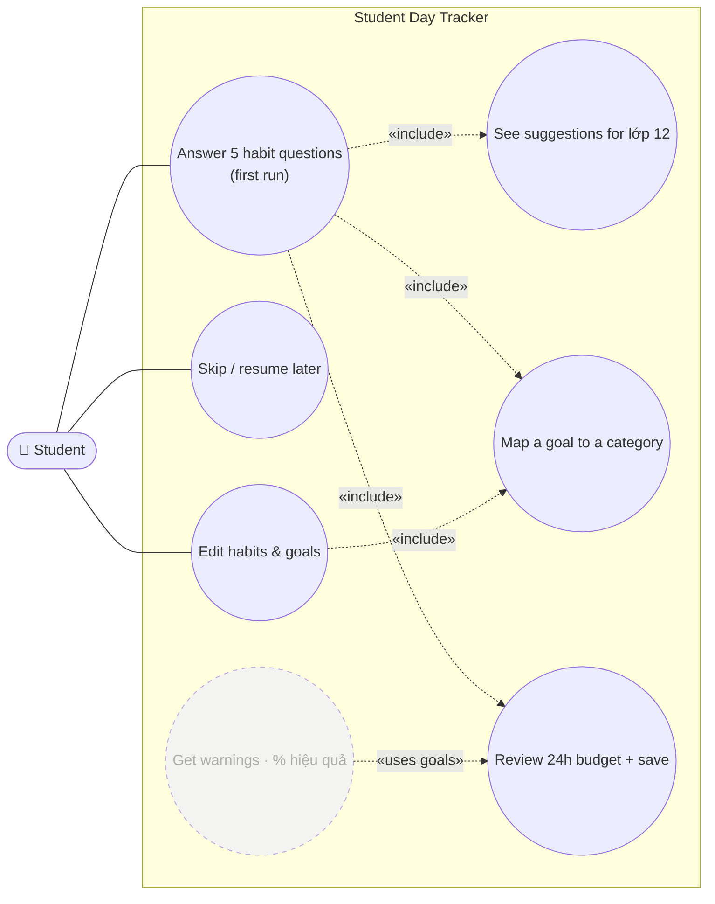

*Dashed = later slices (4, 5) that consume the saved goals.*

---

## 1. Frontend

### 1.1 Scope

A five-question wizard after the first sign-in, a review screen, a “finish setting up” banner, and a Habits & goals
page to edit later. The images in §1.2 are the target the implementer must match.

**Trong scope:**

- Wizard (desktop centered card, mobile full height): welcome → Q1–Q5 → review; progress bar “Question n of 5”; Back / Next; **Skip for now**
- Inputs: hour steppers with suggestion chips, `<input type="time">` for bedtime and school blocks, weekday chips, “Counts toward ▾” category select
- Review: stacked 24-hour bar in category colours, per-goal rows with Edit, free time left, amber **tight day** hint when < 2h is left
- Home banner when the wizard was skipped or left unfinished, with **Continue (n of 5)**
- **Habits & goals** page (`/goals`) with the same fields in one form + “Re-run questionnaire”; reachable from the account menu
- Five new default categories visible everywhere categories appear (Add Activity select, summaries, Insights)

**Ngoài scope (explicit):**

- Warnings, comments and % efficiency (slices 4–5) — this slice only collects and stores goals
- Different targets for weekdays vs. weekends (D4), grade other than lớp 12 (D3)
- Vietnamese UI translation of the whole app (D10)

### 1.2 Structure of UI

Rendered from the live app (real fonts, tokens and layout) with the new screens injected. Sample user *Minh Anh*,
suggested lớp 12 values.

> **Approved by the owner on 2026-10-03.** These images are the acceptance reference in §2.7.

**Sitemap**

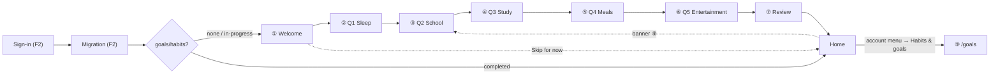

#### ① Welcome — desktop

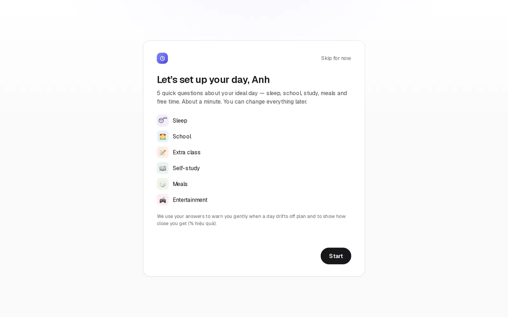

Shown once after the first sign-in. Lists the six goal areas with their new category icons and explains what the
answers are used for (warnings, % hiệu quả). **Start** or **Skip for now**.

#### ② Q1 Sleep — desktop

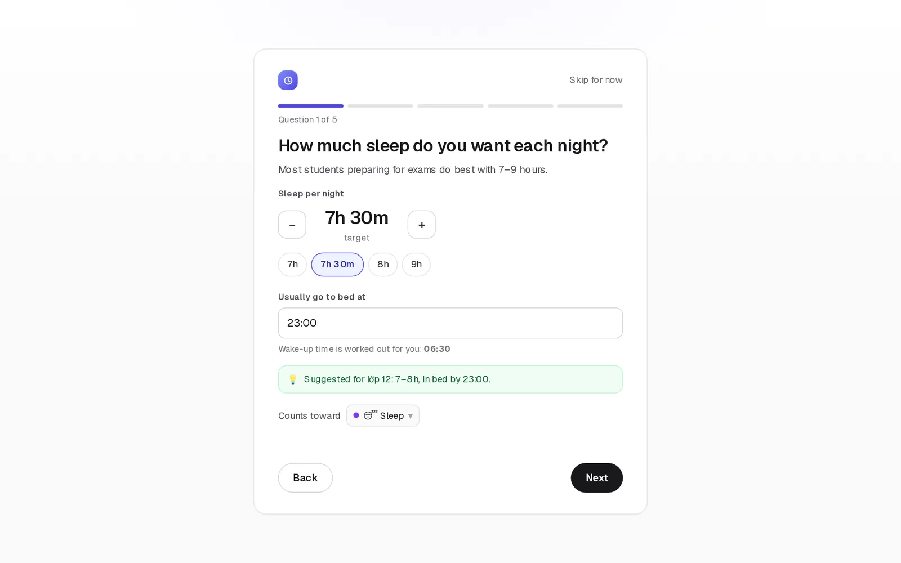

Stepper in 15-minute steps plus chips; bedtime as a time input; wake-up time is derived (bedtime + sleep, can cross
midnight — slice 1). Green hint with the lớp 12 suggestion. “Counts toward 😴 Sleep ▾”.

#### ③ Q2 School · ④ Q3 Study · ⑤ Q4 Meals · ⑥ Q5 Entertainment — mobile

| ③ School | ④ Study | ⑤ Meals | ⑥ Entertainment |
|---|---|---|---|
| 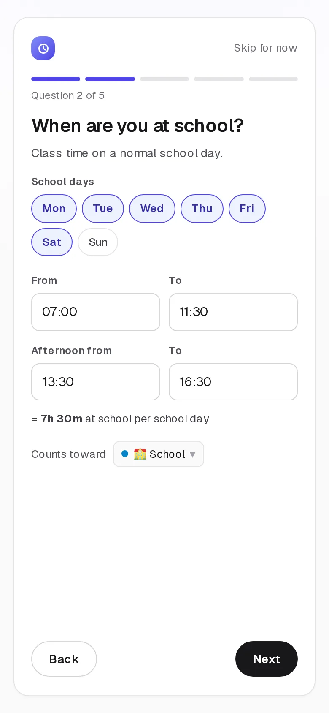 | 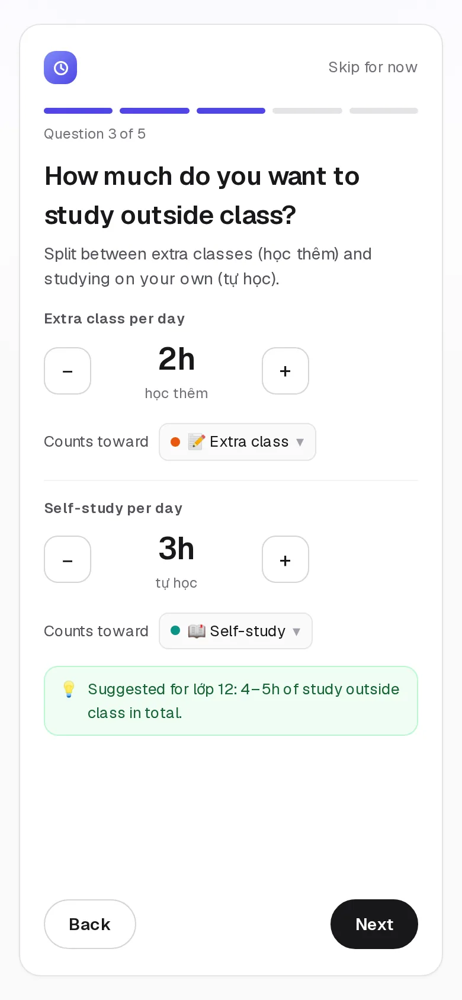 | 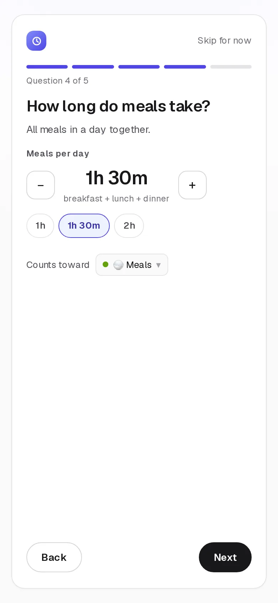 | 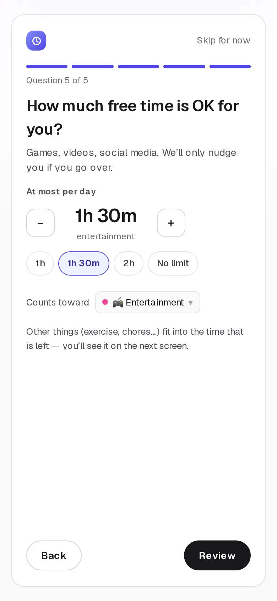 |
| Weekday chips; two fixed time blocks (morning / afternoon — owner accepted the fixed pair 2026-10-04); total per school day shown live. | Two steppers: **học thêm** and **tự học**, each mapped to its own category. | Total meal time per day, chips 1h / 1h 30m / 2h. | A **cap** (“at most”), not a target; “No limit” allowed. Button reads **Review**. |

#### ⑦ Review — desktop

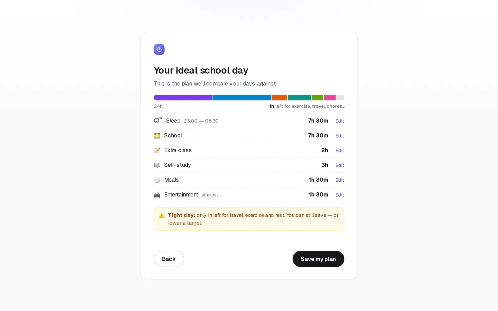

The 24-hour bar shows how the answers fit in a day; grey = time left for exercise, travel, chores. Under 2h left → amber
**Tight day** hint (saving is still allowed); over 24h → error, cannot save (D6). **Save my plan** marks onboarding
completed.

#### ⑧ Home with “Finish setting up” banner — desktop

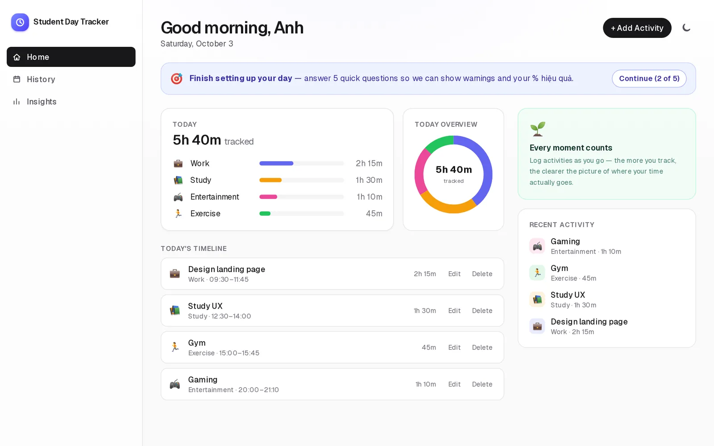

Shown while onboarding is skipped or unfinished. **Continue (n of 5)** resumes at the saved step. Dismissing is not
offered — it disappears once the plan is saved.

#### ⑨ Habits & goals page — desktop

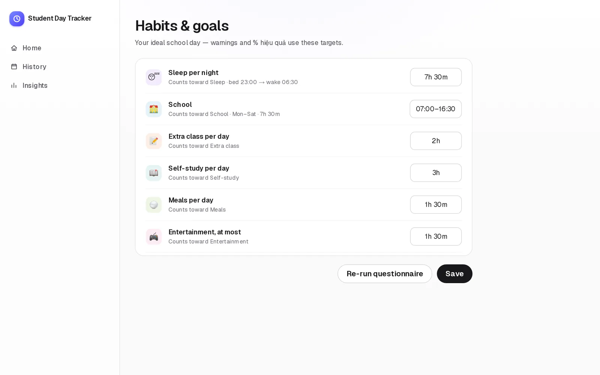

> **Owner decision 2026-10-04:** the built page reuses the wizard's +/− steppers and inputs per row instead of the single compact value box shown here — accepted.

Same data as the wizard in one form, opened from the account menu (new item “Habits & goals” in F2’s ⑥ / ⑧). Changes
apply from the day they are saved (D8).

**Requirement → component**

| Requirement | Screen | Component (planned) | Status |
|---|---|---|---|
| “Ở lần đầu tiên … đặt khoảng 5 câu hỏi” | ① – ⑦ | `src/components/onboarding-wizard.tsx` (+ one component per question) | Proposed |
| “đưa ra các gợi ý” | ② – ⑥ | `src/lib/suggested-habit-goals.ts`, `suggestion-hint.tsx` | Proposed |
| “ngủ … thời gian bắt đầu ngủ” | ② ⑦ | `sleep-question.tsx`, wake-up via `spanDurationMinutes` | Proposed |
| “đi học, giải trí, các vấn đề khác” + “học thêm / tự học / ăn” | ③ – ⑥ | `school-question.tsx`, `study-question.tsx`, `meals-question.tsx`, `entertainment-question.tsx` | Proposed |
| D-B (iii) | ② – ⑥ ⑨ | `category-map-select.tsx`, `DEFAULT_CATEGORIES` | Proposed |
| Editable later | ⑧ ⑨ | `onboarding-banner.tsx`, `src/app/goals/page.tsx`, account menu item | Proposed |

### 1.3 Task

| Phase | Step | File(s) | Depends on | Risk |
|---|---|---|---|---|
| 1 | Wizard shell: steps, progress, Back/Next/Skip, focus moves to the step heading on change, Esc does nothing (not a dialog) | `src/components/onboarding-wizard.tsx` | F2 auth gate | Med |
| 1 | Question components ②–⑥ with stepper, chips, time inputs, weekday chips | `src/components/onboarding/*.tsx` | — | Med |
| 1 | `CategoryMapSelect` (“Counts toward ▾”) listing defaults + custom categories | `src/components/category-map-select.tsx` | new defaults | Low |
| 2 | Review ⑦: stacked bar (SVG, colours from categories, `aria-label` per segment), rows with Edit jumping back to the step, tight-day hint, >24h error | `src/components/onboarding/review-step.tsx` | `getDayBudget` | Med |
| 2 | Home banner ⑧ + gate logic (none / in-progress → wizard on first run, banner afterwards) | `src/components/onboarding-banner.tsx`, `auth-gate.tsx`, `src/app/page.tsx` | §2 hooks | Med |
| 3 | `/goals` page ⑨ + account-menu item | `src/app/goals/page.tsx`, `account-menu.tsx` | Phase 1 | Low |
| 3 | Design tokens only; dark mode for every new element; mobile layout as in ③–⑥ | all above | — | Low |

---

## 2. Backend

### 2.1 Scope

Store the answers per user, validate them with pure helpers, add five default categories, and expose hooks for the UI
and for slices 4–5.

**Trong scope:**

- `users/{uid}/goals/habits` document (schema in §2.3), written by the wizard and the Habits & goals page
- Pure helpers: `buildHabitGoals`, `suggestedHabitGoals`, `getDayBudget`, `getWakeTime`
- `DEFAULT_CATEGORIES` += Sleep, School, Extra class, Self-study, Meals (code only, per F2 Q7)
- Hook `useHabitGoals()` (live, offline-capable via the Firestore cache)
- Security Rules for the document, mirroring `buildHabitGoals` limits; rules tests

**Ngoài scope (explicit):**

- Evaluating days against goals (`evaluateGoals`, slice 4) and `% hiệu quả` (slice 5)
- Goal history / versioning over time (D8)

### 2.2 Defaults (tạm chốt)

| # | Question | Default | Grounding |
|---|---|---|---|
| D1 | Which 5 questions? | Sleep (hours + bedtime) · School (days + blocks) · Study outside class (học thêm + tự học) · Meals · Entertainment cap | Requirement examples, in its order |
| D2 | Mandatory? | No — **Skip for now**; banner ⑧ until saved; progress saved per step | “Ở lần đầu tiên” asks to *suggest*, not to block |
| D3 | Suggestions for which grade? | lớp 12 only: sleep 7h30 (bed 23:00), school Mon–Sat 07:00–11:30 + 13:30–16:30, học thêm 2h, tự học 3h, meals 1h30, entertainment ≤ 1h30 | Users are students taking the university entrance exam |
| D4 | Weekday vs. weekend targets? | One set; school applies only on the chosen school days | Keeps ~5 questions; revisit in slice 4 |
| D5 | Category mapping | New defaults pre-selected; any default or custom category allowed; same category may back two goals | D-B (iii) |
| D6 | Limits | Sleep 4–12h; học thêm 0–8h; tự học 0–10h; meals 15m–4h; entertainment 0–12h or none; school blocks inside 05:00–22:00, `end > start`, not overlapping, ≤ 2 blocks; planned total (excl. entertainment cap) ≤ 24h | Plausible ranges; mirrors F2 rule-limit pattern |
| D7 | Tight day | Free time < 2h → amber hint, save allowed | Don’t block honest answers |
| D8 | Edits | Overwrite the single document; new values apply from the save date (`updatedAt`) | Simple; history deferred |
| D9 | Existing “Work” default | Kept (users may also study + work); not shown in the questionnaire | Avoid breaking migrated data |
| D10 | Language | English UI like the rest of the app; Vietnamese words kept where the requirement uses them (học thêm, tự học, lớp 12, % hiệu quả) | Consistency with F2 screens |

### 2.3 Requirements

**Data model** — `users/{uid}/goals/habits` (times are minutes since midnight, durations in minutes, timestamps in ms):

```ts
interface HabitGoals {
  version: 1;
  status: 'in-progress' | 'skipped' | 'completed';
  lastStep: 0 | 1 | 2 | 3 | 4 | 5;            // resume point for banner ⑧
  sleep: { targetMinutes: number; bedtimeMinutes: number; categoryId: string };
  school: { days: number[]; blocks: { startMinutes: number; endMinutes: number }[]; categoryId: string }; // days: 1 = Mon … 7 = Sun
  extraClass: { targetMinutesPerDay: number; categoryId: string };
  selfStudy: { targetMinutesPerDay: number; categoryId: string };
  meals: { targetMinutesPerDay: number; categoryId: string };
  entertainment: { maxMinutesPerDay: number | null; categoryId: string };
  createdAt: number; updatedAt: number; completedAt?: number;
}
```

New defaults (ids are stable; colours chosen not to clash with existing ones):

| id | Name | Icon | Colour |
|---|---|---|---|
| `sleep` | Sleep | 😴 | `#7c3aed` |
| `school` | School | 🏫 | `#0284c7` |
| `extra-class` | Extra class | 📝 | `#ea580c` |
| `self-study` | Self-study | 📖 | `#0d9488` |
| `meals` | Meals | 🍚 | `#65a30d` |

| Section | User-visible behavior | Acceptance check |
|---|---|---|
| Req.txt “Ở lần đầu tiên” | After the first sign-in (and migration), a user without `goals/habits` sees ① | e2e (emulator): fresh user → ① |
| “đặt khoảng 5 câu hỏi” | Five question steps ②–⑥, then ⑦ | e2e walks all steps |
| “đưa ra các gợi ý” | Each question is prefilled with D3 suggestions and shows the hint | unit: `suggestedHabitGoals()`; e2e: values visible |
| Sleep | Wake-up time derived; bedtime 23:00 + 7h30 → 06:30 | unit `getWakeTime` incl. crossing midnight |
| Review | Bar + rows; < 2h free → hint; > 24h → error, Save disabled | unit `getDayBudget`; e2e for both states |
| Skip / resume | Skip → Home with ⑧; Continue resumes at `lastStep` | e2e: skip at Q2 → banner “(2 of 5)” → resumes at Q2 |
| Edit later | ⑨ saves; Re-run opens ① prefilled | e2e: change sleep → reload → persisted |
| Offline | Answers save offline and sync later (Firestore cache) | e2e: offline save → reload → still there |
| D-B (iii) | New categories appear in Add Activity; mapping changes `categoryId` | unit + e2e |
| Security | Only the owner reads/writes their goals; invalid values rejected | rules tests |

### 2.4 Flow (activity diagram)

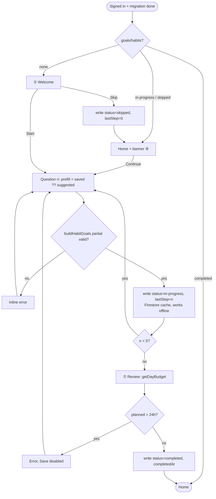

### 2.5 Tasks

| Phase | Step | File(s) | Depends on | Risk |
|---|---|---|---|---|
| 1 Pure | `HabitGoals` type; `buildHabitGoals(input, categories, meta)` throws on D6 violations | `src/lib/types.ts`, `src/lib/build-habit-goals.ts` + test | — | Med |
| 1 Pure | `suggestedHabitGoals()` (D3), `getDayBudget(goals)` → per-category minutes + free + `tight`, `getWakeTime(bed, sleep)` | `src/lib/suggested-habit-goals.ts`, `get-day-budget.ts`, `get-wake-time.ts` + tests | slice 1 `spanDurationMinutes` | Low |
| 1 Pure | Five new entries in `DEFAULT_CATEGORIES` (stable ids, `createdAt` 4–8) | `src/lib/default-categories.ts` + test | — | Low |
| 2 Firebase | `useHabitGoals()` + `saveHabitGoals(scope, goals)` (fire-and-forget per F2 `trackWrite`) | `src/lib/use-habit-goals.ts`, `src/lib/habit-goals-writes.ts` | F2 `UserScope` | Med |
| 2 Firebase | Rules for `users/{uid}/goals/habits` + rules tests | `firestore.rules`, `tests/rules/habit-goals.test.ts` | F2 rules | Med |
| 3 Wire | Gate logic + wizard + banner + `/goals` (see §1.3) | — | Phases 1–2 | Med |
| 4 Docs | ARCHITECTURE data model; REQUIREMENTS §4 status; roadmap slice 2 → shipped | `docs/*`, plan | all | Low |

User step after merge: deploy the updated `firestore.rules` (same as F2 U10): `pnpm exec firebase deploy --only firestore:rules --project student-day-tracker`.

### 2.6 Testing strategy

| Layer | Proves | File |
|---|---|---|
| Unit | D6 limits at boundary −1 / +0; suggestions; budget sums, tight flag, >24h; wake-up across midnight; new defaults present and ordered | `build-habit-goals.test.ts`, `get-day-budget.test.ts`, `get-wake-time.test.ts`, `default-categories.test.ts` |
| Rules | Owner read/write OK; other users and signed-out denied; out-of-range values denied | `tests/rules/habit-goals.test.ts` (emulator) |
| E2E | Fresh user → ① → Q1–Q5 → ⑦ → Home without banner; skip at Q2 → ⑧ “(2 of 5)” → resume; edit on ⑨ persists after reload; offline save | `tests/e2e/onboarding.spec.ts` (Auth + Firestore emulators) |
| a11y | 0 axe violations on ①, a question step, ⑦, ⑧, ⑨ | `tests/e2e/a11y.spec.ts` |

### 2.7 Success criteria

- [ ] A newly signed-in user without goals sees ① after migration; a user with completed goals goes straight to Home.
- [ ] Five question steps ②–⑥ then review ⑦; each step is prefilled with the D3 suggestions and shows the hint.
- [ ] Bedtime 23:00 + 7h 30m shows wake-up 06:30.
- [ ] Review shows the 24h bar; < 2h free shows the tight-day hint; > 24h blocks saving with an inline error.
- [ ] Skip → Home shows banner ⑧; Continue resumes at the saved step; banner disappears after saving.
- [ ] `users/{uid}/goals/habits` matches the §2.3 schema (`status`, `lastStep`, minutes, ms timestamps).
- [ ] Habits & goals ⑨ edits persist after reload and offline.
- [ ] Sleep, School, Extra class, Self-study, Meals appear as default categories (Add Activity, summaries, Insights); “Counts toward” changes the stored `categoryId`.
- [ ] Rules tests: only the owner can read/write; invalid values are rejected.
- [ ] Built screens match approved images ①–⑨.
- [ ] typecheck, check, unit, rules, build, e2e and a11y (0 violations) all pass.

---

## Consequences

- ✅ Slices 4–5 get one typed, validated source of targets (`useHabitGoals`) instead of re-asking the student.
- ✅ D-B (iii) lands without a data migration: new defaults live in code (F2 Q7), mappings are just `categoryId`s.
- ✅ Works offline after the first sign-in, like the rest of the app.
- ⚠️ Nine default categories make the Add Activity select longer; may need grouping later.
- ⚠️ One set of targets for every day (D4) — weekend-specific goals would need a schema `version: 2`.
- ⚠️ Overwriting goals (D8) means slice 5 can’t recompute old weeks against the targets that applied then.
- ⚠️ Requires F2 to be merged first (auth gate, `UserScope`, rules file).
