# ADR-009: Daily feedback loop — rating, warnings & comments, AI comments, % hiệu quả, parent view

| | |
|---|---|
| **Status** | **Accepted** — owner approved 2026-10-04 (images ①–⑬, defaults D1–D16 incl. D6 formula, D14 parent scope, D15 role choice). Review: GitHub issue #3. |
| **Covers slices** | 3 Daily satisfaction rating · 4 Goal-violation warnings + rule-based comments · F3 AI comments · 5 % efficiency · 8 Parent-facing view |
| **Requirement** | `requirement/Requirement.txt` — “Đánh giá mức độ hài lòng trong ngày”; “… đưa ra cảnh báo nếu activity của User đang vi phạm. Đưa ra nhận xét cho người dùng.”; “Khi học sinh đăng nhập sẽ dựa vào chuẩn đầu vào tính % hiệu quả đưa ra nhận xét”; “… hỗ trợ gợi ý cho học sinh và phụ huynh” — `docs/REQUIREMENTS.md` §4 |
| **Depends on** | [ADR-007](./ADR-007-firebase.md) (Firebase, Spark plan) · [ADR-008](./ADR-008-onboarding-habits.md) (goals = “chuẩn đầu vào”) · F2 account + sign-in in [`plans/2026-10-01-v2-roadmap-cross-midnight.html`](../plans/2026-10-01-v2-roadmap-cross-midnight.html) · slice 1 (sleep crosses midnight) |
| **Changes** | Brings slice 8 (parent view) into scope — ADR-007 had left it out. Adds a role choice after the first sign-in (affects the ADR-008 flow). |

## Context

ADR-008 collects the student's ideal day (`users/{uid}/goals/habits`). The remaining v2 requirements all **read**
those goals and the logged activities to give feedback: how the day felt (rating), where it broke the plan
(warnings + comments), a percentage against the plan when the student opens the app, an optional AI-written comment,
and a view for parents. They share one evaluation core, so they are designed together. Constraints from ADR-007:
Spark plan (no Cloud Functions, no Storage), client-side only, works offline after the first sign-in, users are minors.

## Decision

1. **One pure evaluation core** in `src/lib/`: `evaluateDay(activities, goals, date, now)` → per-goal actual vs target
   + status (`ok` / `below` / `over`) + findings. Warnings, comments, % efficiency, AI input and parent summaries all
   derive from it.
2. **Rating (slice 3):** 5-point emoji scale + optional note (≤ 280 chars), one per day, on Home; History and Insights
   show it.
3. **Warnings + rule-based comments (slice 4):** a **“Today vs your plan”** card on Home (live, calm wording, no
   red/green “good/bad”), and weekly **rule-based comments** on Insights built from templates.
4. **% hiệu quả (slice 5):** per-goal score capped at 100 %, averaged; shown in a **welcome-back** dialog on the first
   open of the day (“Khi học sinh đăng nhập…”) for yesterday, and weekly on Insights.
5. **AI comments (F3):** opt-in after a consent sheet; once a day the client sends **aggregated numbers only** to
   Gemini via **Firebase AI Logic**, protected by **App Check (reCAPTCHA Enterprise)**; result cached per day;
   rule-based comments are always the fallback.
6. **Parent view (slice 8):** the **student shares** with a one-time code; a parent signs in with their own Google
   account, picks “I'm a parent”, enters the code, and sees **summaries only** (no activity names, notes or AI text).
   The student's client writes a daily summary document that Security Rules let linked parents read. The student can
   stop sharing at any time.

## Use-case diagram (UD)

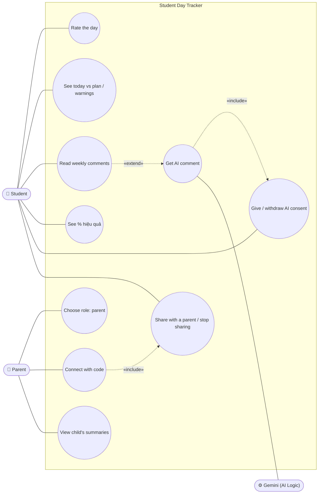

---

## 1. Frontend

### 1.1 Scope

New cards on Home and Insights, a welcome-back dialog, the AI consent sheet, and the parent flow. The images in §1.2
are the target the implementer must match.

**Trong scope:**

- **Home:** “Today vs your plan” card (status per goal, one calm nudge line) and “How was your day?” rating card
- **Welcome-back dialog** on the first open of a day: yesterday's % hiệu quả ring, per-goal bars, one comment (AI if on, else rule-based), “Rate yesterday”
- **Insights:** “% hiệu quả · this week” section (ring + daily bars + per-goal bars), “How your days felt” (rating trend), “Comments on your week” (rule-based or Gemini, with a label)
- **AI consent** bottom sheet / dialog; AI on/off item in the account menu; offline / over-quota fallback state
- **History:** the selected day shows its rating and its % (reuses the components)
- **Parent flow:** “Share with a parent” dialog (student), role choice after the first sign-in, enter-code screen, parent dashboard (`/parent`) with child switcher

**Ngoài scope (explicit):**

- Push notifications / reminders (would need the Notification permission and Functions)
- Parent ↔ student messaging, parents editing goals
- AI comments for parents (parents get rule-based comments only — D14)

### 1.2 Structure of UI

Rendered from the live app (real fonts, tokens, layout) with the new elements injected. Sample student *Minh Anh*
(goals from ADR-008), sample parent *Mẹ*.

> **Approved by the owner on 2026-10-04.** These images are the acceptance reference in §2.7.

**Sitemap**

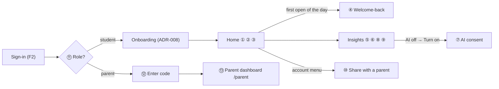

#### ① Home: today vs your plan + rating — desktop

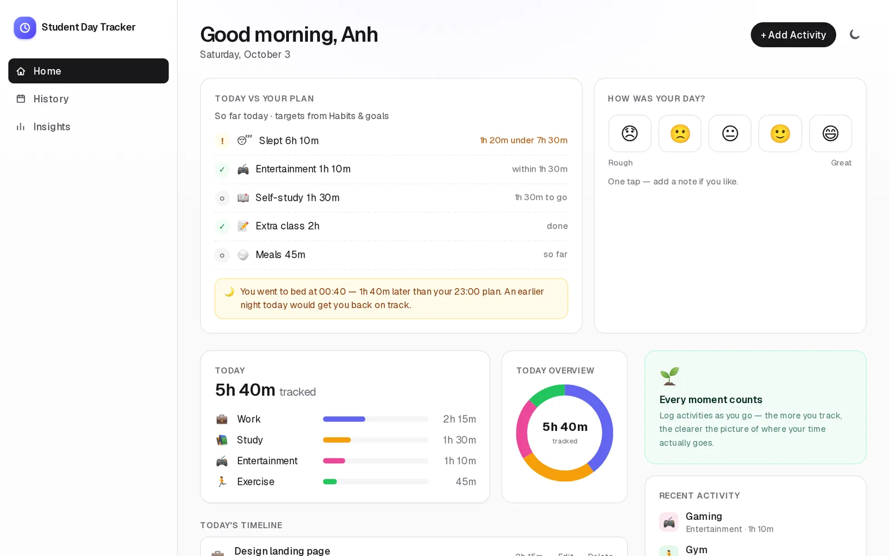

Status icons: ✓ on plan · ! over a cap / under a finished target · ○ still to go. One amber nudge line at most. Copy
stays neutral (docx §3.2: no good/bad framing).

#### ② Home plan card · ③ Rating with note — mobile

| ② Today vs your plan | ③ How was your day? |
|---|---|
| 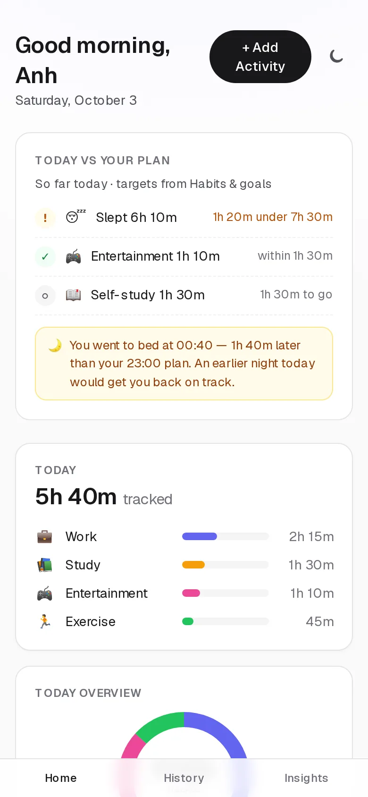 | 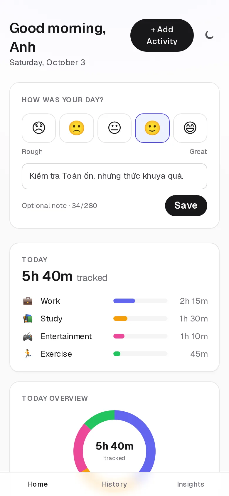 |
| Mobile shows the three most relevant rows; tap opens the full list. | One tap saves the score; the note is optional (≤ 280 chars) and private. |

#### ④ Welcome-back: yesterday's % hiệu quả — desktop

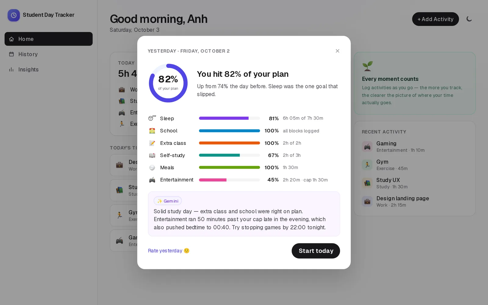

Shown once per day on the first open (after sign-in or app start) when yesterday has data — this is “Khi học sinh
đăng nhập … tính % hiệu quả đưa ra nhận xét”. The comment is Gemini if AI is on (⑧), otherwise rule-based.

#### ⑤ Insights: % hiệu quả this week + how the days felt — desktop

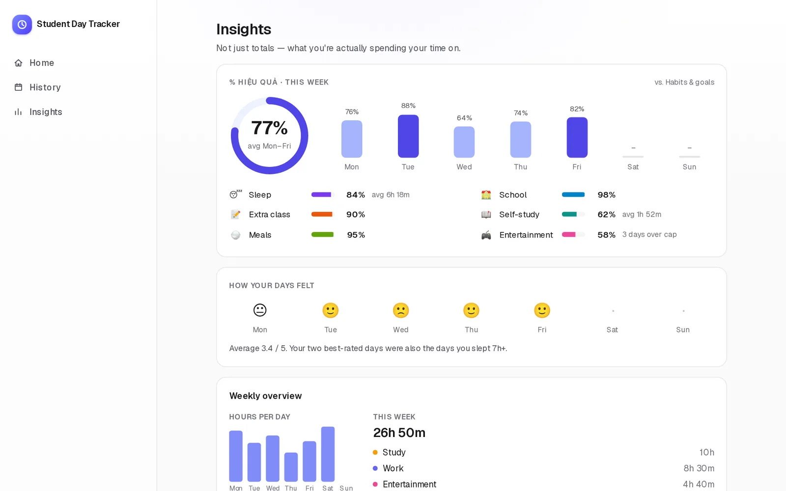

New sections above the existing Weekly overview. Days without tracked activity show “–” and are left out of the
average.

#### ⑥ Rule-based comments · ⑧ AI comment — desktop

| ⑥ Rule-based (AI off) | ⑧ Gemini (AI on) |
|---|---|
| 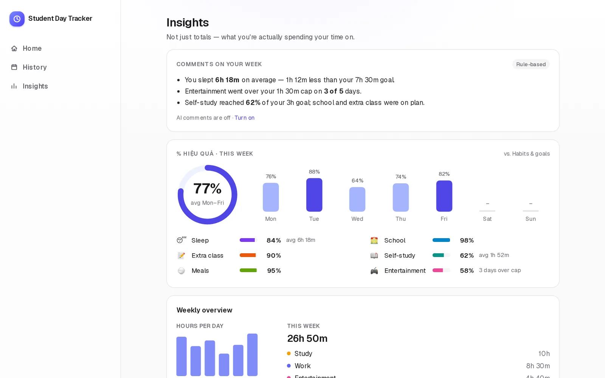 | 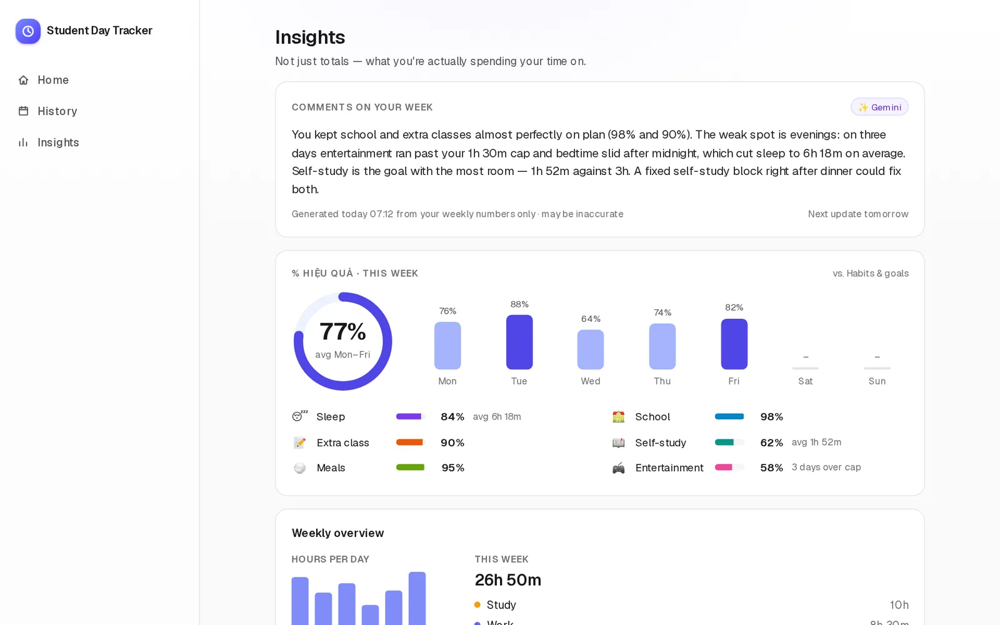 |
| Template sentences from `evaluateWeek`. Always available, offline too. | One paragraph per day, cached; the label and footer make the source and limits clear. |

#### ⑦ AI consent · ⑨ AI fallback — mobile

| ⑦ Consent | ⑨ Offline / unavailable |
|---|---|
| 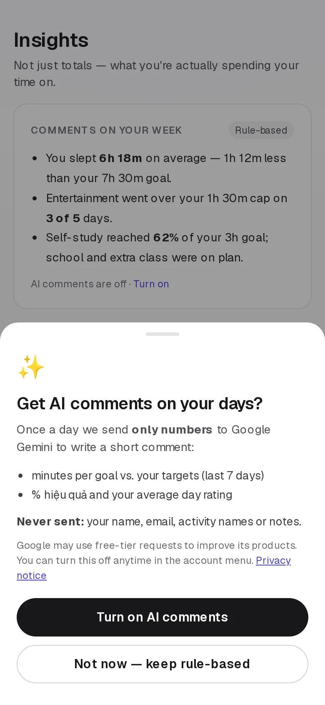 | 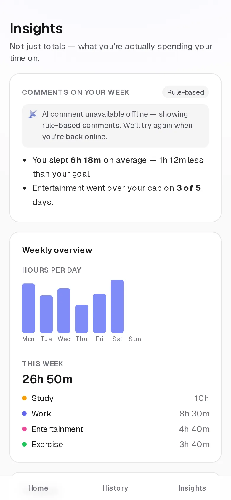 |
| Shown before the first AI call; choice stored on the profile; reversible in the account menu. | Offline, over quota, App Check failure or model error → rule-based, no error dialog. |

#### ⑩ Share with a parent — student, desktop

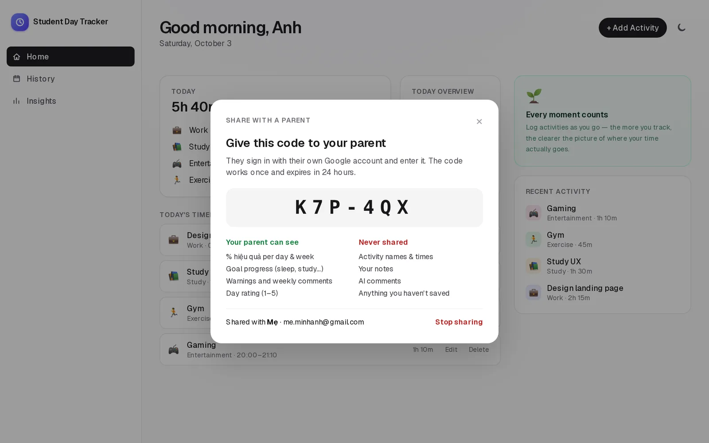

Opened from the account menu (new item “Share with a parent”). Lists exactly what is and isn't shared; shows current
parents with **Stop sharing**.

#### ⑪ Role choice · ⑫ Enter code — parent, mobile

| ⑪ Who's using the app? | ⑫ Connect to your child |
|---|---|
| 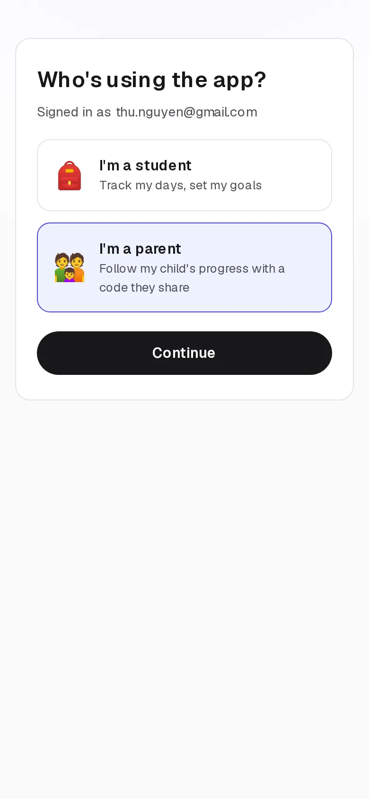 | 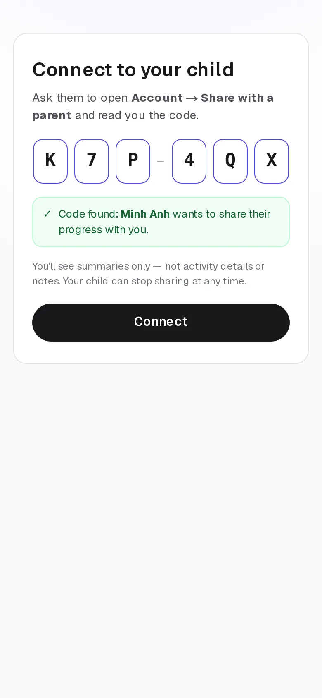 |
| Asked once after the first sign-in (before ADR-008 onboarding). Parents skip onboarding and data migration. | The code is checked before connecting and shows the child's name for confirmation. |

#### ⑬ Parent dashboard — desktop

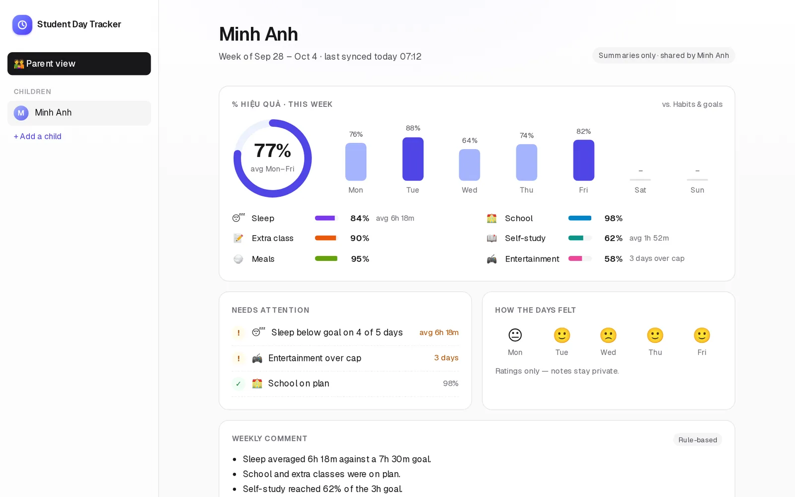

Read-only. Same efficiency component as ⑤; ratings without notes; rule-based comment plus a gentle tip for the parent.

**Requirement → component**

| Requirement | Screen | Component (planned) | Status |
|---|---|---|---|
| “Đánh giá mức độ hài lòng trong ngày” | ① ③ ⑤ | `day-rating-card.tsx`, `rating-trend.tsx` | Proposed |
| “cảnh báo nếu activity … vi phạm” | ① ② ⑬ | `plan-status-card.tsx` | Proposed |
| “Đưa ra nhận xét” | ④ ⑥ ⑧ ⑨ ⑬ | `week-comments.tsx` (rule-based + AI) | Proposed |
| “Khi học sinh đăng nhập … % hiệu quả” | ④ ⑤ ⑬ | `welcome-back-dialog.tsx`, `efficiency-section.tsx`, `efficiency-ring.tsx` | Proposed |
| AI (ADR-007) | ⑦ ⑧ ⑨ | `ai-consent-sheet.tsx`, AI state in `week-comments.tsx` | Proposed |
| “… cho học sinh và phụ huynh” | ⑩ ⑪ ⑫ ⑬ | `share-with-parent-dialog.tsx`, `role-choice.tsx`, `enter-code.tsx`, `src/app/parent/page.tsx` | Proposed |

### 1.3 Task

| Phase | Step | File(s) | Depends on | Risk |
|---|---|---|---|---|
| 1 | Rating card ①③ (radio group of 5, `aria-label` “n of 5”, note textarea with counter) + History day rating | `src/components/day-rating-card.tsx`, `src/app/history/page.tsx` | §2 hooks | Low |
| 1 | Plan status card ①② (status icon + text, never colour alone) | `src/components/plan-status-card.tsx` | `evaluateDay` | Med |
| 2 | Efficiency ring + bars (SVG, `role="img"` + labels), Insights section ⑤, rating trend | `efficiency-ring.tsx`, `efficiency-section.tsx`, `rating-trend.tsx`, `src/app/insights/page.tsx` | `getEfficiency` | Med |
| 2 | Welcome-back dialog ④ (focus trap, once per day flag) | `src/components/welcome-back-dialog.tsx`, `src/app/page.tsx` | above | Med |
| 3 | Comments card ⑥⑧⑨ with source label, consent sheet ⑦, account-menu AI toggle | `week-comments.tsx`, `ai-consent-sheet.tsx`, `account-menu.tsx` | §2 AI | Med |
| 4 | Share dialog ⑩, role choice ⑪, enter code ⑫, parent dashboard ⑬ with child switcher; parent nav shows only Parent view | `share-with-parent-dialog.tsx`, `role-choice.tsx`, `enter-code.tsx`, `src/app/parent/page.tsx`, `sidebar-nav.tsx`, `auth-gate.tsx` | §2 sharing | High |
| 5 | Tokens only, dark mode, mobile layouts as shown | all above | — | Low |

---

## 2. Backend

### 2.1 Scope

Pure evaluation helpers, three new per-user documents, AI Logic + App Check wiring, the sharing model and its
Security Rules — all client-side on the Spark plan.

**Trong scope:**

- Pure: `evaluateDay`, `evaluateWeek`, `getEfficiency`, `buildRuleComments`, `buildAiInput`, `buildDaySummary`, `buildDayRating`, invite-code helpers
- Firestore: `dayRatings/{date}`, `aiComments/{date}`, `summaries/{date}` under `users/{uid}`; `parents/{parentUid}` link; top-level `invites/{code}`; `role` + `aiConsent` on the profile
- Firebase AI Logic (Gemini Developer API) with **App Check `ReCaptchaEnterpriseProvider`** (site key from U6), debug token locally
- Security Rules + rules tests for every new path, including parent read access

**Ngoài scope (explicit):**

- Cloud Functions, scheduled jobs, notifications (Blaze)
- Server-side AI calls or storing raw prompts
- Goal history (ADR-008 D8) — % uses the current goals

### 2.2 Defaults (tạm chốt)

| # | Question | Default | Grounding |
|---|---|---|---|
| D1 | Rating scale | 1–5 as emoji 😞🙁😐🙂😄, labels Rough / Great | “mức độ hài lòng”; one tap |
| D2 | Which days can be rated? | Today and the previous 7 days | Lets the welcome-back “Rate yesterday” work |
| D3 | Warning timing | **Caps** (entertainment, bedtime) warn live; **targets** show “to go” during the day and become a warning only after the day ends; sleep is judged on the sleep span that ends today | Avoid nagging at 10:00 that self-study is “missed” |
| D4 | Bedtime tolerance | Warn when bedtime is > 30 min after the goal | Calm tone |
| D5 | Wording | Neutral, specific numbers, one suggestion at most; no red/green for good/bad | docx §3.2 |
| D6 | **% formula (needs owner OK)** | Per goal: target goals `min(actual / target, 1)`; school `logged school minutes ÷ planned` on school days only; entertainment cap `1` if ≤ cap else `max(0, 1 − (actual − cap) / cap)`. Day % = mean over the goals that apply that day. Week % = mean of tracked days. | Simple, explainable to students and parents |
| D7 | Untracked days | No activity that day → “–”, excluded from averages | Don't punish not logging |
| D8 | When % is shown “on login” | Welcome-back ④ on the first open of each day, for yesterday, if yesterday has data | Requirement wording |
| D9 | AI model / language | Gemini Flash-family on the free tier (exact model id chosen at implementation); English like the UI | ADR-007; ADR-008 D10 |
| D10 | AI input | Only numbers: per-goal minutes vs targets (7 days), % per day, average rating, bedtime offsets. Never names, emails, activity names, notes | ADR-007 privacy; minors |
| D11 | AI frequency | ≤ 1 call per user per day (weekly comment), cached in `aiComments/{date}`; reused by ④ | Spark quota is per project |
| D12 | App Check | `ReCaptchaEnterpriseProvider` with the U6 site key; **enforce** on AI Logic only after the release is verified (owner step) | U6 done; enforcing early blocks the app |
| D13 | Sharing | Student creates a 6-char code (no 0/O/1/I), single use, 24 h; up to 2 parents per student; a parent can follow several children | Families with two parents / siblings |
| D14 | What parents see | `summaries/{date}` only: day %, per-goal actual/target/score, warning codes, rating score. Not notes, activity names/times, AI text | Minor's privacy (Nghị định 13/2023) |
| D15 | Role | Asked once after the first sign-in; stored as `role`; a parent account skips onboarding and migration; changeable later only by signing out and contacting support (not in UI) | Keeps flows separate |
| D16 | Summary writes | The student's client upserts `summaries/{date}` (debounced) whenever that day's activities, goals or rating change — only while at least one parent is linked | No Functions on Spark |

### 2.3 Requirements

**Data model** (minutes since midnight / durations in minutes / timestamps in ms):

```ts
// users/{uid}  (profile from F2, new fields)
role: 'student' | 'parent';
aiConsent?: { granted: boolean; at: number };

// users/{uid}/dayRatings/{IsoDate}
interface DayRating { score: 1 | 2 | 3 | 4 | 5; note?: string /* ≤ 280 */; updatedAt: number }

// users/{uid}/aiComments/{IsoDate}
interface AiComment { text: string; model: string; inputHash: string; createdAt: number }

// users/{uid}/summaries/{IsoDate}   (readable by linked parents)
interface DaySummary {
  efficiency: number | null;                         // 0–100, null = untracked
  goals: Record<'sleep'|'school'|'extraClass'|'selfStudy'|'meals'|'entertainment',
                { actual: number; target: number | null; score: number | null }>;
  warnings: ('sleep-short'|'bedtime-late'|'entertainment-over'|'target-missed')[];
  ratingScore: number | null;
  updatedAt: number;
}

// users/{studentUid}/parents/{parentUid}
interface ParentLink { displayName: string; email: string; inviteCode: string; createdAt: number }

// invites/{code}   (top-level, get-by-id only, never listable)
interface Invite { studentUid: string; studentName: string; expiresAt: number; usedBy?: string }
```

**Security Rules (sketch)**

- `dayRatings`, `aiComments`, `goals`, `activities`, `categories`: owner only.
- `summaries/{date}`: owner read/write; **read** also if `exists(/users/$(uid)/parents/$(request.auth.uid))`.
- `parents/{parentUid}`: owner (student) read/delete; **create** by `request.auth.uid == parentUid` only when
  `invites/{code}` (from the new doc's `inviteCode`) exists, `studentUid == uid`, not expired, not used, and the same
  batch sets `usedBy` (`getAfter`).
- `invites/{code}`: create by the student (`studentUid == auth.uid`, expiry ≤ 24 h); `get` by any signed-in user;
  `list` denied; update only to set `usedBy` once.

| Section | User-visible behavior | Acceptance check |
|---|---|---|
| Rating | Tap saves a 1–5 score for the day; note ≤ 280; editable for 7 days | unit `buildDayRating`; e2e save → reload |
| Warnings | Card shows per-goal status per D3–D5 | unit `evaluateDay` table tests (time-of-day, cross-midnight sleep, bedtime +31 min) |
| Rule comments | Weekly templates, neutral wording | unit `buildRuleComments` snapshot; grep: no “good/bad/bad day” strings |
| % hiệu quả | D6 formula; untracked days “–” | unit `getEfficiency` incl. cap formula, school days only |
| Welcome-back | Once per day, for yesterday, only with data | e2e with mocked clock |
| AI consent | No AI call before consent; withdraw stops calls | unit + e2e with mocked AI client |
| AI call | ≤ 1/day, cached, input contains numbers only | unit `buildAiInput` (no strings from activities/notes); e2e mocked |
| AI fallback | Offline / error → rule-based with notice | e2e offline |
| Share | Code single-use, 24 h; Stop sharing removes access immediately | rules tests + e2e (two emulator users) |
| Parent view | Parent sees summaries only; reading activities/notes denied | rules tests |
| App Check | Tokens attached; enforcement later by owner | manual on live after release |

### 2.4 Flow (activity diagrams)

**Open of the day → % hiệu quả → comment**

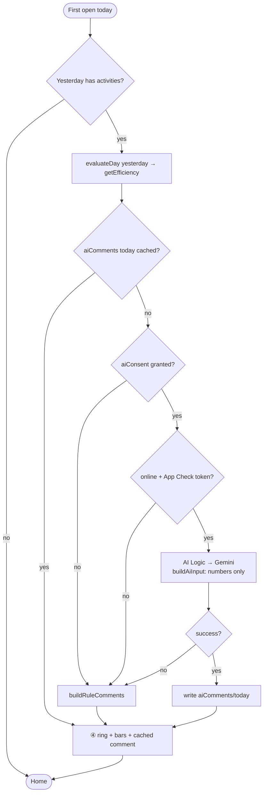

**Sharing with a parent**

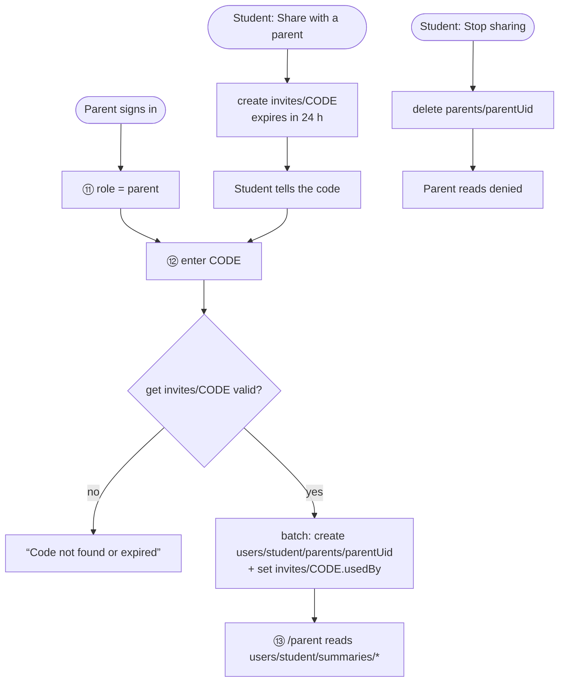

### 2.5 Tasks

| Phase | Step | File(s) | Depends on | Risk |
|---|---|---|---|---|
| 1 Pure | `evaluateDay` / `evaluateWeek` (uses `sessionKey`, sleep span ending today) | `src/lib/evaluate-day.ts`, `evaluate-week.ts` + tests | ADR-008 goals, slice 1 | High |
| 1 Pure | `getEfficiency` (D6), `buildRuleComments` (D5 templates), `buildDaySummary`, `buildDayRating` | `src/lib/get-efficiency.ts`, `build-rule-comments.ts`, `build-day-summary.ts`, `build-day-rating.ts` + tests | above | Med |
| 1 Pure | `buildAiInput` (numbers only) + `hashAiInput`; invite code `generateInviteCode`, `normalizeInviteCode` | `src/lib/build-ai-input.ts`, `invite-code.ts` + tests | above | Low |
| 2 Firebase | Hooks + writes: `useDayRating`, `useDaySummaries` (student + parent), `useAiComment`, `useParentLinks`, `useLinkedChildren`; summary upsert (D16) | `src/lib/use-*.ts`, `src/lib/*-writes.ts` | F2 `UserScope` | Med |
| 2 Firebase | AI Logic client (`getAI`, `GoogleAIBackend`, `getGenerativeModel`) + App Check `ReCaptchaEnterpriseProvider`, debug token via env in dev | `src/lib/ai.ts`, `src/lib/firebase.ts` | U5, U6 | Med |
| 2 Firebase | Rules for all new paths (§2.3) + rules tests incl. two-user parent cases | `firestore.rules`, `tests/rules/*.test.ts` | F2 rules | High |
| 3 Wire | Components from §1.3; role gate in `auth-gate.tsx`; parent route | — | Phases 1–2 | High |
| 4 Docs | ARCHITECTURE, REQUIREMENTS §4 status, roadmap (slices 3, 4, F3, 5, 8) | `docs/*`, plan | all | Low |

**User steps (Vietnamese, after merge):**

1. Deploy rules: `pnpm exec firebase deploy --only firestore:rules --project student-day-tracker`.
2. Sau khi kiểm tra web chạy ổn: Firebase Console → **App Check → APIs → Firebase AI Logic → Enforce**.
3. Tạo **App Check debug token** cho máy dev nếu cần thử AI ở `localhost` (không thêm localhost vào reCAPTCHA key).

### 2.6 Testing strategy

| Layer | Proves | File |
|---|---|---|
| Unit | `evaluateDay` table: each goal × time of day × cross-midnight sleep; D6 formula incl. cap and school days; untracked days; comment templates; AI input has no strings from activities/notes; invite code alphabet | `src/lib/*.test.ts` |
| Rules | Owner-only paths; parent can read `summaries` only when linked; cannot read activities/ratings notes/aiComments; invite single-use + expiry; stop sharing revokes | `tests/rules/*.test.ts` (emulator) |
| E2E | Rate → reload; plan card states; welcome-back once per day (mocked clock); consent → mocked AI comment → cached; offline fallback; student shares → second emulator user as parent connects → sees ⑬ → student stops sharing → parent denied | `tests/e2e/feedback.spec.ts`, `tests/e2e/parent.spec.ts` |
| a11y | 0 axe violations on ①–⑬ states | `tests/e2e/a11y.spec.ts` |

No real Gemini calls in tests: the AI client is injected and mocked; App Check uses the debug provider in emulator
builds.

### 2.7 Success criteria

- [ ] Rating: one tap saves 1–5 for today; note ≤ 280; previous 7 days editable; History shows it.
- [ ] Home “Today vs your plan” follows D3–D5 (caps live, targets after day end, sleep span, bedtime +30 min).
- [ ] Rule-based weekly comments appear on Insights, neutral wording, offline too.
- [ ] % hiệu quả matches D6 in unit tests; untracked days show “–” and are excluded.
- [ ] Welcome-back ④ shows once per day for yesterday when yesterday has data.
- [ ] No AI call before consent; ≤ 1 call per user per day; AI input contains only numbers; failures fall back silently with a notice.
- [ ] App Check `ReCaptchaEnterpriseProvider` initialised with the U6 site key; debug token in dev only.
- [ ] A parent can connect only with a valid, unused, unexpired code; sees summaries only; access ends immediately after Stop sharing (rules tests).
- [ ] Parents never receive notes, activity names/times or AI text (rules + e2e).
- [ ] Built screens match approved images ①–⑬.
- [ ] typecheck, check, unit, rules, build, e2e and a11y (0 violations) all pass.

---

## Consequences

- ✅ One evaluation core feeds warnings, comments, %, AI input and parent summaries — numbers always agree across screens.
- ✅ Stays on the Spark plan: no Functions; AI via AI Logic; parent access enforced by Security Rules.
- ✅ Privacy by construction: parents and Gemini only ever see aggregated numbers.
- ⚠️ Parent data is only as fresh as the student's last open (summaries are written by the student's client, D16).
- ⚠️ The D6 formula is a product decision — changing it later changes every historical % (no stored history beyond `summaries`).
- ⚠️ Gemini free-tier quota is shared by all users; heavy use may push some days to rule-based comments.
- ⚠️ Parent linking adds the first cross-user rules — highest-risk part; needs thorough rules tests before release.
- ⚠️ Supersedes ADR-007's “parent view out of scope”; ADR-008's flow gains the role choice before onboarding.
